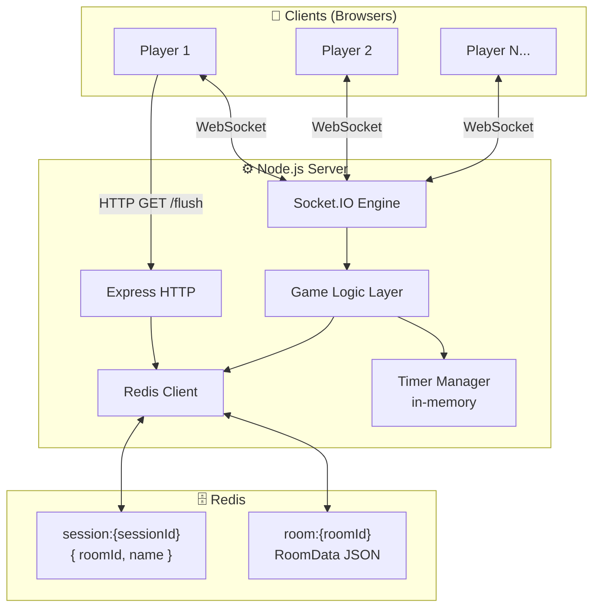
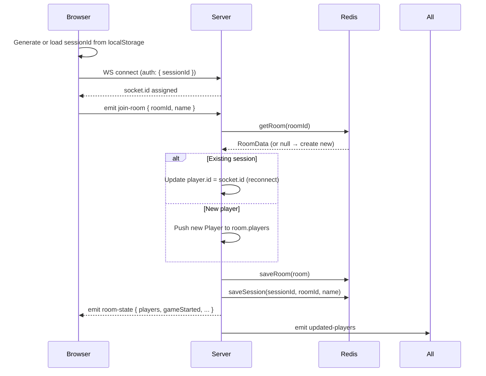
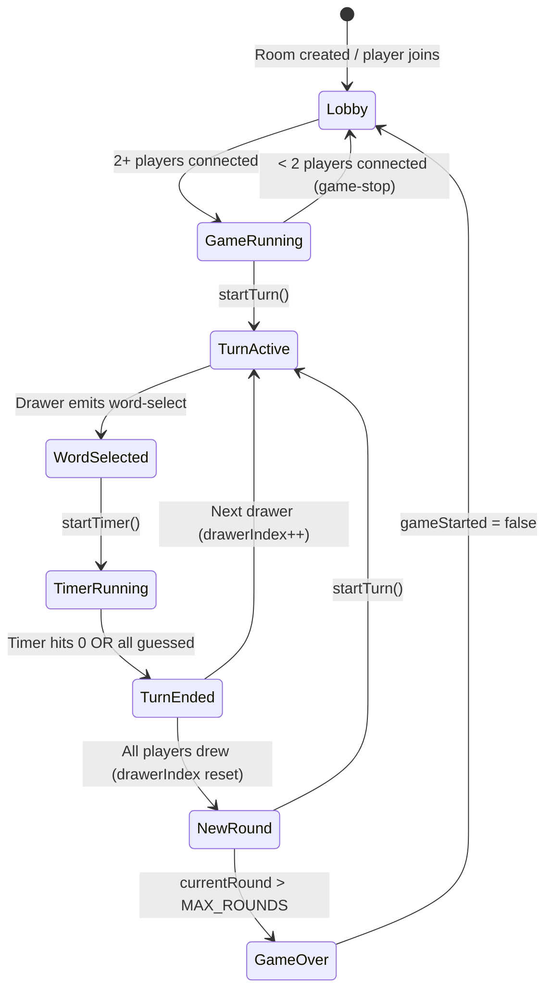
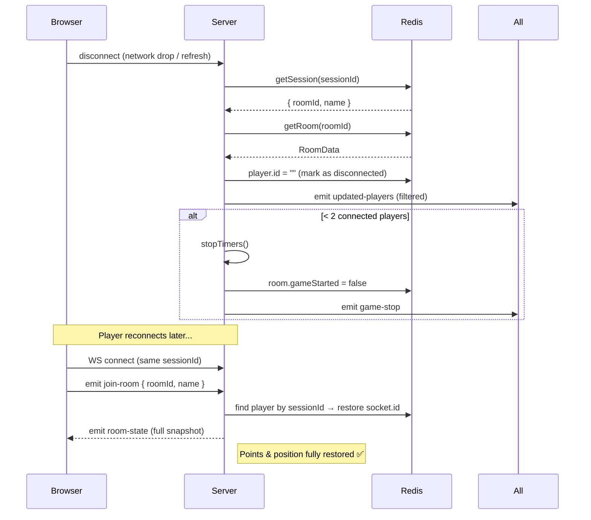

# 🏗️ Architecture Deep-Dive

> A thorough breakdown of the system design, data flow, and every major subsystem in the Skribbl Clone backend.

---

## Overview

The backend is a **single Node.js process** that exposes both an HTTP server (Express) and a WebSocket server (Socket.IO) on the same port. All persistent state lives in **Redis**. There is no database — Redis is the single source of truth.

```
┌─────────────────────────────────────────────────────┐
│                    CLIENT (Browser)                  │
│                  Socket.IO Client                    │
└──────────────────────┬──────────────────────────────┘
                       │  WebSocket + HTTP
┌──────────────────────▼──────────────────────────────┐
│                   Node.js Server                     │
│  ┌─────────────┐   ┌──────────────────────────────┐  │
│  │   Express   │   │        Socket.IO             │  │
│  │  (HTTP REST)│   │  (Real-time event bus)       │  │
│  └─────────────┘   └──────────────┬───────────────┘  │
│                                   │                  │
│       ┌───────────────────────────▼──────────────┐   │
│       │         Game Logic Layer                  │   │
│       │  startGame / startTurn / endTurn          │   │
│       │  startTimer / stopTimers / endGame        │   │
│       └───────────────────────────┬──────────────┘   │
│                                   │                  │
│       ┌───────────────────────────▼──────────────┐   │
│       │         Redis Client (ioredis)            │   │
│       │   getRoom / saveRoom / getSession /       │   │
│       │   saveSession                             │   │
│       └───────────────────────────┬──────────────┘   │
└───────────────────────────────────│──────────────────┘
                                    │
┌───────────────────────────────────▼──────────────────┐
│                      Redis                            │
│   room:{id}     → JSON(RoomData)   TTL: 24h           │
│   session:{id}  → JSON({roomId, name}) TTL: 24h       │
└───────────────────────────────────────────────────────┘
```

---

## System Architecture Diagram (Mermaid)



---

## Connection & Session Flow



---

## Game Lifecycle



---

## Turn Flow (Detailed)

```mermaid
sequenceDiagram
    participant Server
    participant Drawer
    participant Guessers
    participant Redis
    participant Timers

    Server->>Redis: getRoom()
    Server->>All: emit start-turn { drawer, round, maxRounds }
    Server->>Drawer: emit word-choices { words: [w1, w2, w3] }

    Drawer->>Server: emit word-select { roomId, word }
    Server->>Redis: room.currentWord = word; saveRoom()
    Server->>All: emit word-length { length }
    Server->>Drawer: emit your-word { word }
    Server->>Timers: startTimer(roomId)

    loop Every second
        Timers->>Redis: r.secondsLeft--; saveRoom()
        Timers->>All: emit timer-tick { secondsLeft }
    end

    Guessers->>Server: emit send-chat { roomId, message }

    alt Correct guess
        Server->>Redis: correctGuessers.push(socketId); player.points += secondsLeft*2
        Server->>All: emit correct-guess { player, players }

        alt All non-drawers guessed
            Server->>Server: endTurn()
        end
    else Wrong guess
        Server->>All: emit receive-chat { message, player }
    end

    alt Timer expires
        Timers->>Server: endTurn()
    end

    Server->>Timers: stopTimers()
    Server->>All: emit end-turn { word, players }
    Server->>Redis: reset currentWord & correctGuessers
```

---

## Disconnect & Reconnect Handling



---

## Redis Data Model

### `room:{roomId}` — TTL: 24h

```json
{
  "id": "abc123",
  "players": [
    {
      "id": "socket_xyz",
      "sessionId": "uuid-stable-id",
      "name": "Alice",
      "points": 240
    }
  ],
  "gameStarted": true,
  "drawerIndex": 1,
  "currentWord": "elephant",
  "secondsLeft": 42,
  "correctGuessers": ["socket_aaa"],
  "currentRound": 2
}
```

### `session:{sessionId}` — TTL: 24h

```json
{
  "roomId": "abc123",
  "name": "Alice"
}
```

> **Why two keys?**
> The `session` key lets the server locate which room a disconnecting player belonged to, using only their `sessionId` — without scanning every room.

---

## Timer Architecture

Timers are stored **in-memory** in a `timers` record keyed by `roomId`:

```ts
const timers: Record<string, {
  turnTimer: NodeJS.Timeout | null;    // (unused reserve slot)
  countDownTimer: NodeJS.Timeout | null; // setInterval, fires every 1s
}> = {};
```

### Why this matters

| Property | Detail |
|---|---|
| **Authoritative** | `secondsLeft` is written to Redis every tick — clients always get the real value on reconnect |
| **Cancellable** | `stopTimers(roomId)` clears both timers immediately on turn end or disconnect |
| **Not distributed** | Timers live only on the current process. A server restart loses active timers. Room state in Redis survives, but the countdown doesn't auto-resume. |

For a distributed/multi-process setup, consider Bull/BullMQ or Redis keyspace notifications.

---

## Point Scoring Formula

```
points_awarded = secondsLeft × 2
```

- Max possible per turn: `60 × 2 = 120 points`
- Rewarded as soon as a correct guess is detected
- Drawer does **not** score (only guessers earn points)

---

## Security & Authorization Model

| Action | Guard |
|---|---|
| `word-select` | `drawer.id === socket.id` — only the active drawer can set the word |
| `draw-line` | `drawer.id === socket.id` — only the drawer can send strokes |
| `clear-canvas` | `drawer.id === socket.id` |
| `send-chat` | Drawer is blocked from guessing their own word |
| `/flush` | No auth — **remove or gate this in production** |

---

## Scaling Considerations

| Concern | Current approach | Production recommendation |
|---|---|---|
| **State** | Redis (shared) ✅ | Already horizontally scalable |
| **Timers** | In-process ⚠️ | Move to BullMQ / Redis keyspace events |
| **Socket routing** | Single node ⚠️ | Add `socket.io-redis` adapter for multi-node |
| **Auth** | Session UUID only ⚠️ | Add signed JWT or HTTP-only cookie validation |
| **/flush endpoint** | Unprotected ❌ | Remove or add admin middleware |

---

## Dependencies

| Package | Role |
|---|---|
| `express` | HTTP server & REST endpoint |
| `socket.io` | WebSocket event bus |
| `redis` | Redis client (node-redis v4) |
| `uuid` | Session ID generation |
| `cookie-parser` | Parse cookies (future auth use) |
| `cors` | Cross-origin policy |
| `dotenv` | Environment config |